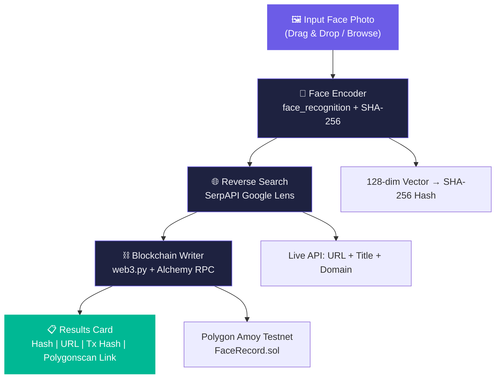

<p align="center">
  <h1 align="center">⛓️ FaceChain</h1>
  <p align="center">
    <strong>Face ID + Blockchain Verification Pipeline</strong>
  </p>
  <p align="center">
    Detect a face • Reverse-search the web • Write an immutable record on-chain
  </p>
  <p align="center">
    
    
    
    
  </p>
</p>

---

## 📖 Overview

**FaceChain** is an end-to-end Python desktop application that combines **facial biometrics**, **real-time web intelligence**, and **blockchain immutability** into a single verification pipeline:

1. **Face Detection & Encoding** — Uses dlib's HOG detector and the `face_recognition` library to extract a 128-dimensional face embedding vector, hashed into a deterministic **SHA-256 fingerprint**.

2. **Live Reverse Image Search** — Uploads the face photo to **SerpAPI's Google Lens** endpoint for a genuine reverse-image search, returning a real matching public URL with page title and source domain. _No hardcoded results — every response is a live API call._

3. **Blockchain Verification** — Connects to the **Polygon Amoy Testnet** via Alchemy's free RPC, and writes the face hash, matched URL, timestamp, and submitter wallet address to a deployed Solidity smart contract (`FaceRecord.sol`), returning a **real, verifiable transaction hash** viewable on [amoy.polygonscan.com](https://amoy.polygonscan.com).

The desktop UI features a **dark-themed, glassmorphism-styled interface** built with CustomTkinter, complete with drag-and-drop image input, animated step-by-step progress tracking, and a results card with clickable Polygonscan explorer links.

---

## 🏗️ Architecture



---

## 🛠️ Tech Stack

| Layer              | Technology                                       | Purpose                                    |
|--------------------|--------------------------------------------------|--------------------------------------------|
| **Desktop UI**     | CustomTkinter 5.x                                | Dark-themed modern desktop interface       |
| **Face Detection** | face_recognition + dlib                          | HOG face detection, 128-dim encoding       |
| **Hashing**        | Python hashlib (SHA-256)                         | Deterministic biometric fingerprint        |
| **Image Search**   | SerpAPI (Google Lens engine)                     | Live reverse image search with file upload |
| **Blockchain**     | web3.py 6.x + Alchemy RPC                       | Polygon Amoy Testnet transactions          |
| **Smart Contract** | Solidity ^0.8.0                                  | On-chain record storage & retrieval        |
| **Compilation**    | py-solc-x                                        | Solidity compiler for deployment           |
| **Config**         | python-dotenv                                    | Secure secret management via .env          |

---

## 📋 Prerequisites

| Requirement      | Why                                                                 |
|------------------|---------------------------------------------------------------------|
| **Python 3.9+**  | Required for type hints and library compatibility                   |
| **CMake**        | Required to build dlib (dependency of face_recognition)             |
| **C++ Compiler** | MSVC (Windows), gcc/g++ (Linux), or clang (macOS) for dlib          |
| **MetaMask**     | To create a wallet and export a private key                         |
| **SerpAPI Account** | Free tier gives 100 searches/month — [serpapi.com](https://serpapi.com) |
| **Alchemy Account** | Free tier for Polygon Amoy RPC — [alchemy.com](https://alchemy.com) |

### Windows-Specific Notes

```bash
# Install CMake (if not already installed)
winget install Kitware.CMake

# Or via pip
pip install cmake

# Visual Studio Build Tools are required for dlib compilation
# Download from: https://visualstudio.microsoft.com/visual-cpp-build-tools/
# Select "Desktop development with C++" workload
```

---

## 🚀 Setup & Installation

### 1. Clone the Repository

```bash
git clone https://github.com/YOUR_USERNAME/FaceChain.git
cd FaceChain
```

### 2. Create a Virtual Environment

```bash
python -m venv venv

# Windows
venv\Scripts\activate

# macOS / Linux
source venv/bin/activate
```

### 3. Install Dependencies

```bash
pip install -r requirements.txt
```

> **Note:** Installing `dlib` may take several minutes as it compiles from source.

### 4. Configure Environment Variables

```bash
cp .env.example .env
```

Edit `.env` and fill in your actual values:

| Variable            | How to Get It                                                                        |
|---------------------|--------------------------------------------------------------------------------------|
| `SERPAPI_KEY`       | Sign up at [serpapi.com](https://serpapi.com) → Dashboard → API Key                  |
| `ALCHEMY_RPC_URL`   | Sign up at [alchemy.com](https://alchemy.com) → Create App → Select **Polygon Amoy** → Copy HTTPS URL |
| `PRIVATE_KEY`       | MetaMask → Account Details → Export Private Key                                      |
| `CONTRACT_ADDRESS`  | Generated in Step 5 below                                                            |

### 5. Get Testnet POL Tokens

You need testnet POL to pay for gas fees:

1. Go to [faucet.polygon.technology](https://faucet.polygon.technology/)
2. Select **Amoy** network
3. Paste your wallet address
4. Request POL tokens

### 6. Deploy the Smart Contract

```bash
python deploy_contract.py
```

This will:
- Install the Solidity 0.8.0 compiler
- Compile `contract/FaceRecord.sol`
- Deploy to Polygon Amoy Testnet
- Print the deployed contract address

Copy the printed address into your `.env` file as `CONTRACT_ADDRESS`.

### 7. Run the Application

```bash
python main.py
```

---

## 🖥️ How to Use

1. **Launch** the app with `python main.py`
2. **Drag & drop** a face photo onto the left panel (or click to browse)
3. **Click "Verify Identity"** to start the pipeline
4. **Watch** the 3-step progress tracker animate through each stage:
   - ✅ Step 1: Face detected and encoded
   - ✅ Step 2: Reverse search match found
   - ✅ Step 3: Record written to blockchain
5. **View results** in the right panel:
   - SHA-256 face hash (click to copy)
   - Matched URL with page title and domain (click to open)
   - Transaction hash (click to copy)
   - **"View on Polygonscan"** button for on-chain proof

---

## ⛓️ Which Blockchain and Why?

| Property         | Value                                                        |
|------------------|--------------------------------------------------------------|
| **Network**      | Polygon Amoy Testnet                                         |
| **Chain ID**     | 80002                                                        |
| **Token**        | POL (testnet)                                                |
| **Explorer**     | [amoy.polygonscan.com](https://amoy.polygonscan.com)         |
| **RPC Provider** | Alchemy (free tier)                                          |
| **Consensus**    | Proof of Stake (anchored to Ethereum Sepolia)                |

**Why Polygon Amoy?**
- ⚡ **Fast finality** — transactions confirm in ~2-5 seconds
- 💰 **Free testnet tokens** — no real money needed for development
- 🔗 **EVM-compatible** — standard Solidity, works with MetaMask & web3.py
- 📊 **Full block explorer** — every transaction is verifiable on Polygonscan
- 🏗️ **Production-ready path** — same code deploys to Polygon Mainnet

> **Note:** Polygon Mumbai Testnet was deprecated in April 2024. Amoy is its official successor.

---

## 📂 Project Structure

```
FaceChain/
├── main.py                 # Desktop UI application (CustomTkinter)
├── face_encoder.py         # Face detection + SHA-256 hashing module
├── reverse_search.py       # SerpAPI Google Lens reverse search module
├── blockchain.py           # Web3.py Polygon Amoy client module
├── deploy_contract.py      # One-time contract deployment script
├── contract/
│   └── FaceRecord.sol      # Solidity smart contract (^0.8.0)
├── .env.example            # Environment variable template
├── .gitignore              # Git ignore rules
├── requirements.txt        # Python dependencies
└── README.md               # This file
```

---

## 🔒 Security Considerations

- **Private keys** are loaded from `.env` and never logged or displayed in the UI
- `.env` is excluded from version control via `.gitignore`
- Face encodings are **hashed with SHA-256** before being sent to the blockchain — raw biometric vectors are never stored on-chain
- The smart contract is deployed on a **testnet** — do not use real funds
- SerpAPI keys should be kept confidential and rotated periodically

---

## ⚠️ Known Limitations

1. **face_recognition + dlib** requires CMake and a C++ compiler, which can be challenging to install on some systems.

2. **SerpAPI free tier** is limited to 100 searches/month. The Google Lens engine may not find matches for all face photos — it works best with publicly recognizable faces.

3. **Polygon Amoy** is a testnet. Transactions have no monetary value and the network may be reset. For production use, deploy to Polygon Mainnet.

4. **Drag-and-drop** requires the optional `tkinterdnd2` package. If not installed, click-to-browse still works normally.

5. **Image size** for SerpAPI upload should be under 500 KB for best results. Very large images may need to be resized.

6. **Gas estimation** uses fixed values (50 gwei max fee). During network congestion, transactions may be slow or fail.

7. **Single face**: When multiple faces are detected, only the largest face (by bounding box area) is processed.

---

## 📄 License

This project is licensed under the **MIT License** — see the [LICENSE](LICENSE) file for details.

---

<p align="center">
  Built with 🧬 biometrics, 🌐 web intelligence, and ⛓️ blockchain immutability
</p>
